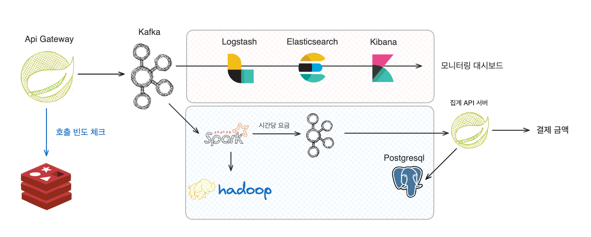
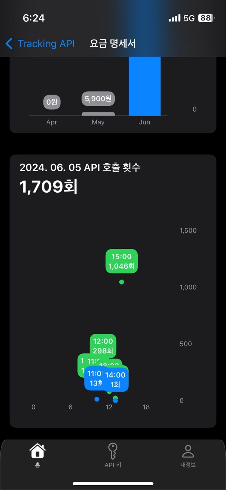
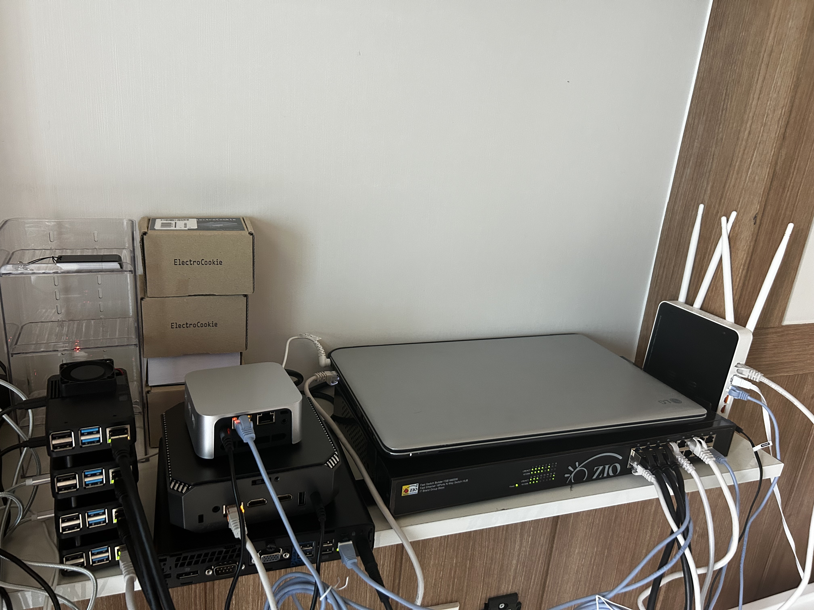
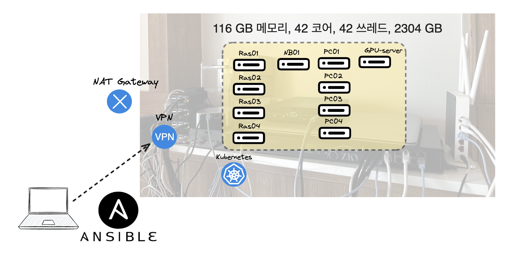
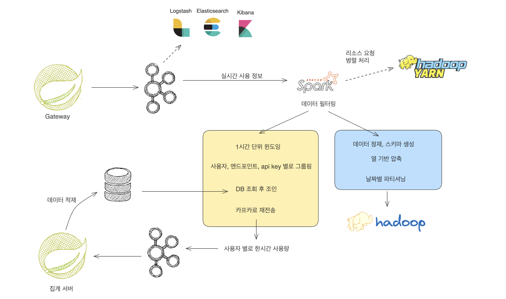
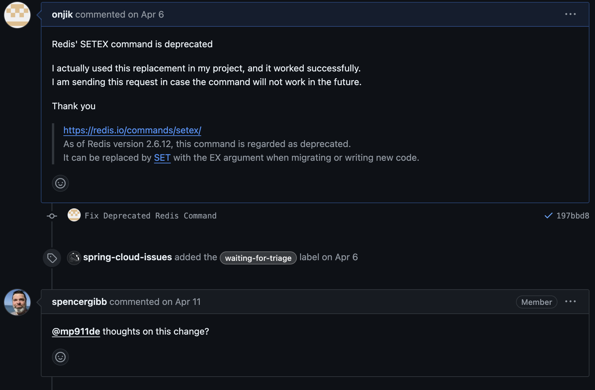
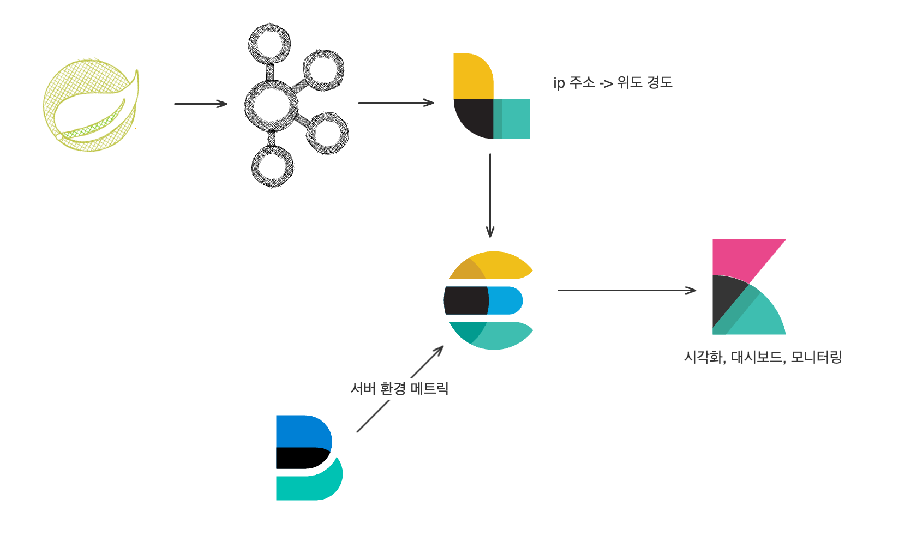
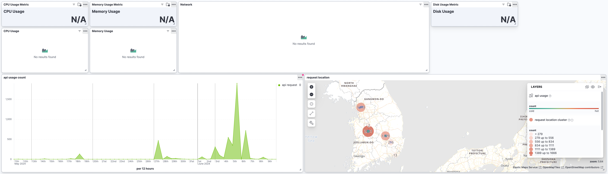

# 위치추적 모듈 프로젝트

사용한 만큼 지불하는 위치추적 모듈 프로젝트입니다.

## 프로젝트 기본 정보
팀원 : 4명(backend 3, ios 1)

진행 기간 : 2024.03 ~ 2024.06

주요 역할(본인) : 
- 사용량 기반 비용 청구 기능 개발
    - Gateway, 비용 쿼리 서버 개발
- Gateway 개발
    - Rate Limiter 개발

## 📌 어려웠던 점 : 사용량 기반 비용 청구 기능

목표
- 고객이 사용한 만큼 비용을 지불하도록 하여, 초기 도입 비용을 줄인다.

기술적 제약 사항
- 초당 1000개 이상의 API 사용 기록을 처리할 수 있어야 한다.
- 장기간 쿼리(1달 이상)를 실시간 API 로 서빙할 수 있어야 한다.
- 결제 서버에서 이 정보를 활용할 수 있도록 제공해야한다.

결과물

  
   

### 해결 과정
#### 🔸 첫번째 시도 : DB 단발성 INSERT

그래서 맨 처음 나의 생각은 다음과 같았다.
> 그냥 RDB에 때려 넣으면 되는거 아니야?

근데 문제점이 두가지가 있었는데,

1. 처리량이 매우 떨어진다는 점, DB부하가 크다는 점
2. 구간 쿼리시 DB에 상당한 부하가 가고, 느리다는 점

말 그대로 DB의 INSERT 속도에 따라 Gateway 처리량이 제한되었다. 또 초당 평균 1000개 정도의 사용이 예상된다면 한달 쿼리시 25억개의 레코드를 집계해야 했다.

#### 🔸 두번째 시도 : Redis, MongoDB

두번째 시도에서는 Redis를 버퍼로 활용하는 것이었다. 이렇게 되면 DB처리량이 gateway처리량을 제한하지 않을 것이라고 생각했다.

gateway는 포워딩시 redis에 빠르게 삽입하고, 15분 마다 redis 버퍼에서 꺼내서 부분 집계 결과를 mongodb에 넣도록 바꾸었다.

mongodb를 사용한 이유는 대규모, 반정형 데이터를 담기 수월했고, 파이프라인 기능으로 복잡한 집계가 가능하다고 생각했기 때문이다.

하지만 문제는 데이터 유실 가능성이었다.

1. redis의 휘발성 문제
2. redis에서 데이터를 꺼내서, 넣기 직전 문제 발생시 데이터 유실

#### 🔸 세번째 시도 : Hadoop, Spark, Kafka
한달정도 이 기능을 가지고 씨름하던 중 [네이버의 2011년 글](https://d2.naver.com/helloworld/1016)을 보게 되었다. 나와 매우 유사한 고민을 하고 계셨는데, 이 글을 읽고 많은 인사이트를 얻었다.

우선 데이터 유실 문제를 해결하기 위해 Redis 대신 카프카를 분산모드로 구축해 활용하도록 바꾸었다.

그리고 Hadoop 클러스터를 직접 집에 구축해서 로그 원천 저장소로 활용하였다.

  
   

Spark Stream으로 대량의 로그를 분산처리 하도록 하였다.
- 카프카 이벤트를 수신해서 Hadoop 에 적재
- 카프카 이벤트를 수신해서 윈도우 집계

결과적으로는 RDB(Postgresql) 에는 시간당 사용자가 어떤 api 를 몇번 호출했는지에 대한 정보만 담기게 된다.

그리고 비용 조회 서버에서는 이 정보를 바탕으로 간단한 집계만 해서 빠르게 구간 비용을 API로 제공할 수 있다.

### 느낀점, 배운점

이 프로젝트를 하면서, 기술적으로 상당히 많이 성장할 수 있었다. 특히 직접 인프라를 구축해보고 새로운 기술을 도입하기 위해 거의 세달간 수 없이 책과 코드와 씨름했던 경험은 매우 값졌다.

하지만 다음번에 프로젝트를 진행한다면, 요구사항을 먼저 명확히 하고, 처음부터 이 요구사항에 맞는 기술을 선택하는게 개발 시간을 줄일 수 있을 것이라고 생각이 들었다.

## 📌 기타 본인의 역할
### 사용량 제한 기능 개발
등급별로 사용량을 다르게 적용시킬 필요가 있었는데, 이는 Spring Cloud Gateway 에서 기본적으로 제공해주는 기능으로는 완성할 수 없었다.

그래서 직접 코드를 분석해 나만의 API RateLimiter를 구현했다.

Redis의 EVAL 커맨드와 Lua Script로 원자적으로 실행되는 토큰 버킷 알고리즘을 구현했다.

이 과정에서 Spring Cloud Gateway에 기여도 할 수 있었다.

### 모니터링 대시보드 구축
Kafka 로 사용량 메시지를 받는 김에 ELK 로 모니터링 대시보드도 구축하였다.

  
   

